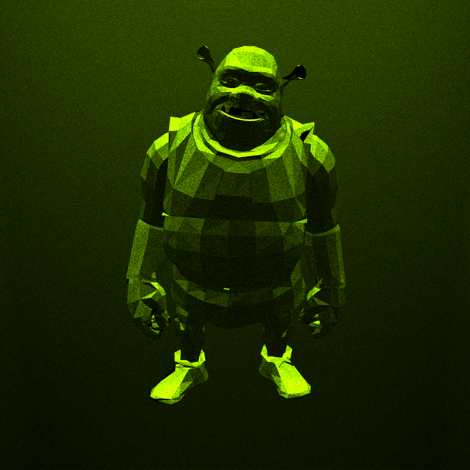
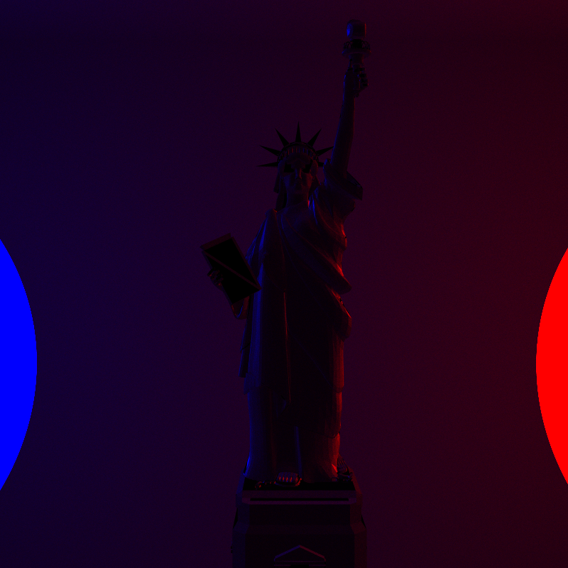

# SimpleRayTracing

**SimpleRayTracing** is a lightweight ray tracing engine built from the ground up in C++. It features core functionality for loading geometry, defining materials and lighting, and rendering photorealistic images. It also includes denoising via Intel® Open Image Denoise (OIDN) and PNG output support via LodePNG.

---

## ✨ Features

- ✅ Load and parse **`.obj` files**
- ✅ Build meshes with **positions and normals** (no texture support)
- ✅ Support for **basic primitives**: Sphere, Plane, and Quadrat
- ✅ Define and handle **multiple light types**
- ✅ Create **simple and complex materials**, including custom BRDFs
- ✅ Fully programmable **scene setup**
- ✅ Perform **ray tracing** with recursive reflection/refraction
- ✅ **Save final renders** as PNG using [LodePNG](https://github.com/lvandeve/lodepng) (version `20190210`)
- ✅ **Denoise output images** using [Intel OIDN](https://www.openimagedenoise.org/) (optional)
- ✅ Uses **custom-built math library** (vectors, matrices, etc.)

---

## 🖼 Example Outputs

<p float = "left">
  
  
</p>

---

## 🚀 Getting Started

### Prerequisites

- A C++ compiler with C++17 support
- CMake
- [OIDN](https://github.com/OpenImageDenoise/oidn) (Intel Open Image Denoise)
- [LodePNG](https://github.com/lvandeve/lodepng)

### Build

```bash
git clone https://github.com/yourusername/simpleraytracing.git
cd simpleraytracing
mkdir build && cd build
cmake ..
make
